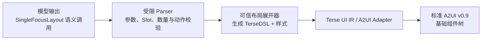

# Widget Service 布局高级组件 Wiki

> 当前范围：第一个布局高级组件 `SingleFocusLayout`。
>
> 表达约定：本文统一使用 **TerseDSL**。高级组件是生成期语义宏，由可信服务端确定性展开为
> “基础组件 + 内联样式对象”的 TerseDSL，再转换为标准 A2UI v0.9；端侧 Catalog 不新增
> `SingleFocusLayout` 节点。

## 1. 设计目标

布局高级组件用于封装稳定的卡片几何关系，让模型表达“单焦点、主辅、同级、列表、动作矩阵”等
布局意图，而不是直接编写任意宽高、间距和定位。

整体链路如下：



边界规则：

- 模型只选择注册过的布局、业务内容和动作，不直接控制任意样式。
- 布局高级组件只负责区域、方向、对齐、间距、裁剪和动作预留区，不读取业务数据。
- 业务高级组件负责字段、文字层级、业务状态和内部微排版。
- 内联样式对象只由可信展开器生成；高级组件名不得进入最终 A2UI。
- 样式直接写在 TerseDSL 组件的末尾 options 对象中，不额外嵌套 `styles` 对象。

## 2. `SingleFocusLayout`

### 2.1 一句话定义

`SingleFocusLayout` 用整张卡片的单一业务区域表达一个主要对象，并可附带一个主动作。

“单一对象”按用户任务判断，不按基础组件数量判断。一个日程详情可以包含标题、时间和地点；一个
健康指标可以包含数值、单位和进度；它们仍分别属于一个主对象。

### 2.2 适用场景

| 场景类型 | 典型内容 | 推荐对齐 | 动作形态 |
| --- | --- | --- | --- |
| 大数值/状态 | 电量、使用时长、睡眠时长、倒计时 | `bottomStart` 或 `centerStart` | 无动作或右下 `IconAction` |
| 单条详情 | 下一日程、未接来电、备忘录 | `topStart` | 底部 `PillAction` |
| 单一进度 | 目标完成度、资源占用、运动进度 | `bottomStart` | 无动作或底部 `PillAction` |
| 单一列表对象 | 同一备忘录的条目、同一日程的子项 | `topStart` | 通常无动作 |
| 单一图片内容 | 产品图、封面或状态插图及简短说明 | `bottomStart` | 右下 `IconAction` |

列表仍必须围绕同一主题。2×2 最多 2 项，2×4 最多 3 项；超过预算时优先减少低优先级条目，
不通过缩小主信息来容纳更多内容。

### 2.3 不适用场景

以下场景不应使用 `SingleFocusLayout`：

- 两个独立且同等重要的对象：使用 `PeerPairLayout` 或 `EqualItemsLayout`。
- 一个主对象加一个独立辅助对象：使用 `HeroSupportLayout`。
- 主对象、辅助对象和动作同时存在：使用 `HeroSupportActionLayout`。
- 用户任务以动作选择为核心，包含 2～4 个操作：使用 `ActionMatrixLayout`。
- 当前天气加未来预报：使用 `WeatherNowForecastLayout`。
- 仅因为数据同时可用就把多个业务模块塞进同一区域。

### 2.4 与 `HeroActionLayout` 的边界

两者都能呈现“一个业务对象 + 一个动作”，但语义优先级不同：

| 判断条件 | 选择 |
| --- | --- |
| 动作是任务完成的必要入口，例如“加入会议”“立即回拨” | `HeroActionLayout` |
| 内容本身是核心，动作只是可选快捷入口 | `SingleFocusLayout` |
| 没有已批准动作 | `SingleFocusLayout` |

这样可以避免同一场景同时暴露两个没有明确差异的布局候选。

## 3. 对外语义契约

### 3.1 调用形式

```text
SingleFocusLayout([config], businessChild[, actionChild]);
```

示例：

```typescript
SingleFocusLayout(
  { "contentAlign": "topStart" },
  Column(
    "compact",
    Text("UI 需求评审会", "title"),
    Text("14:00 - 15:30", "body"),
    Text("深圳园区", "subtitle")
  ),
  PillAction({ "actionId": "event.joinMeeting" })
);
```

`SingleFocusLayout`、`PillAction` 和 `IconAction` 是生成期语义节点；示例中的 `Column`、`Text`
是允许与业务高级组件混排的基础 TerseDSL 节点。

### 3.2 参数

| 参数 | 类型 | 默认值 | 说明 |
| --- | --- | --- | --- |
| `contentAlign` | `topStart \| centerStart \| bottomStart` | `topStart` | 主业务区域在可用空间内的纵向对齐；水平方向固定为 Start |

参数对象是闭合对象，不允许额外字段。布局调用只能有一个业务 child；业务 child 内部可以是一个
业务高级组件展开结果，也可以是一个完整的基础组件子树。

### 3.3 Slot 与数量

| Slot | 2×2 | 2×4 | 约束 |
| --- | ---: | ---: | --- |
| `businessChild` | 1 | 1 | 必填；不得再包含布局高级组件 |
| `actionChild` | 0～1 | 0～1 | 可选；必须是根的最后一个直接 child |

允许的动作：

- `PillAction`：底部整行主动作。
- `IconAction`：右下角紧凑快捷动作。

`ActionTile` 不属于 `SingleFocusLayout`；它用于 2×4 多操作区域。

## 4. UX 规范

### 4.1 通用几何

| Token | 值 | 用途 |
| --- | ---: | --- |
| `radius` | `20vp` | 卡片根圆角 |
| `safeInset` | `12vp` | 卡片四周安全边距 |
| `sectionGap` | `8vp` | 内容区与动作区间距 |
| `denseInnerGap` | `4vp` | 同一业务对象内部的紧密间距 |
| `pillActionHeight` | `36vp` | 胶囊动作高度 |
| `iconActionSize` | `30vp` | 圆形图标动作可见尺寸 |
| `iconActionIconSize` | `16vp` | 圆形动作内部图标尺寸 |

卡片逻辑画布由转换器锁定为 2×2 `160×160vp`、2×4 `320×160vp`。根节点始终铺满宿主卡片，
开启裁剪，任何文字、图片、进度和动作都不得越过 `12vp` 安全区。

### 4.2 无动作

- `topStart`：适合详情文本、备忘录和短列表，阅读顺序从左上开始。
- `centerStart`：适合视觉中心明确且内容很少的图标、状态或单一数值。
- `bottomStart`：适合大数值、进度和图片说明，让主信息形成稳定的下沿。
- 对齐只改变整个业务子树在可用区域中的位置，不改变业务子树内部的文字层级和排列。

### 4.3 底部胶囊动作

- `PillAction` 固定在底部，高 `36vp`，与业务区域保持 `8vp` 间距。
- 业务区域占用剩余高度并允许收缩；不得被按钮覆盖。
- 按钮宽度填满当前布局区域，文字保持单行，推荐约 4 个汉字，最多 6 个汉字。
- 空间不足时先减少正文和低优先级辅助信息，再调整字号；主信息不得优先缩小。

### 4.4 右下图标动作

- `IconAction` 可见容器为 `30×30vp`，图标为 `16×16vp`。
- 布局在内容右侧和底部各预留 `38vp`，即 `30vp` 动作尺寸加 `8vp` 间距。
- 动作层固定右下对齐，内容层固定左上对齐，二者通过 `Stack` 分层。
- 内容不得进入预留区；图标必须来自已批准的本地素材，并与动作语义一致。

### 4.5 文字、信息与溢出

- 普通标题默认 14fp，必要时降到 12fp；保持单行并省略。
- 正文默认 14fp；2×2 最多 3～4 行，2×4 按业务区域预算控制。
- 辅助信息使用 10fp，不能再降低。
- 同一主对象内部最多形成 2 层信息层级（2×2）或 3 层信息层级（2×4）。
- 业务区和根卡片都必须裁剪；超出空间预算时不允许滚动，也不允许突破卡片边界。

## 5. 可信 TerseDSL + 样式展开

以下代码是服务端可信展开结果，不是允许模型自由生成的样式接口。`CONTENT` 和 `ACTION` 仅在本节
表示已经解析并校验通过的 AST 子树。

### 5.1 无动作

```text
Column("compact", {
  "width": "100%",
  "height": "100%",
  "itemMargin": 4,
  "justifyContent": ALIGN,
  "alignItems": "start",
  "clip": true
}, CONTENT)
```

`ALIGN` 的确定性映射：

| `contentAlign` | `justifyContent` |
| --- | --- |
| `topStart` | `start` |
| `centerStart` | `center` |
| `bottomStart` | `end` |

### 5.2 底部 `PillAction`

```text
Column("section", {
  "width": "100%",
  "height": "100%",
  "itemMargin": 8,
  "justifyContent": "spaceBetween"
},
  Column("compact", {
    "layoutWeight": 1,
    "itemMargin": 4,
    "justifyContent": ALIGN,
    "alignItems": "start",
    "clip": true,
    "constraintSize": { "minWidth": 0, "minHeight": 0 }
  }, CONTENT),
  Stack("overlay", {
    "width": "100%",
    "height": 36,
    "padding": 8,
    "borderRadius": 18,
    "alignContent": "center",
    "onClick": APPROVED_EVENT
  }, ACTION_CONTENT)
)
```

### 5.3 右下 `IconAction`

```text
Stack("overlay", { "width": "100%", "height": "100%" },
  Stack("overlay", {
    "width": "100%",
    "height": "100%",
    "alignContent": "topStart"
  },
    Column("compact", {
      "width": "100%",
      "height": "100%",
      "padding": { "right": 38, "bottom": 38 },
      "itemMargin": 4,
      "justifyContent": ALIGN,
      "alignItems": "start",
      "clip": true
    }, CONTENT)
  ),
  Stack("overlay", {
    "width": "100%",
    "height": "100%",
    "alignContent": "bottomEnd"
  },
    Stack("overlay", {
      "width": 30,
      "height": 30,
      "borderRadius": 15,
      "alignContent": "center",
      "onClick": APPROVED_EVENT
    },
      Image(APPROVED_ICON, "icon", {
        "width": 16,
        "height": 16,
        "objectFit": "contain"
      })
    )
  )
)
```

### 5.4 卡片根包装

高级组件展开完成后，服务端统一增加卡片根。宽高由卡片尺寸锁定，不由高级组件手写：

```text
Column("card", {
  "padding": 12,
  "borderRadius": 20,
  "itemMargin": 8,
  "clip": true,
  "backgroundColor": THEME_BACKGROUND
}, LOWERED_SINGLE_FOCUS_CONTENT);
```

## 6. 完整示例

### 6.1 2×2 下一日程 + 打开日历

模型语义输出：

```typescript
SingleFocusLayout(
  { "contentAlign": "topStart" },
  Column(
    "compact",
    Text("UI 需求评审会", "title"),
    Text("14:00 - 15:30", "body"),
    Text("深圳园区", "subtitle")
  ),
  PillAction({ "actionId": "event.openCalendar" })
);
```

可信展开后的 TerseDSL 结构：

```typescript
Column("card", {
  "padding": 12,
  "borderRadius": 20,
  "itemMargin": 8,
  "clip": true,
  "backgroundColor": "background_primary"
},
  Column("section", {
    "width": "100%",
    "height": "100%",
    "itemMargin": 8,
    "justifyContent": "spaceBetween"
  },
    Column("compact", {
      "layoutWeight": 1,
      "itemMargin": 4,
      "justifyContent": "start",
      "alignItems": "start",
      "clip": true,
      "constraintSize": { "minWidth": 0, "minHeight": 0 }
    },
      Text("UI 需求评审会", "title", {
        "maxLines": 1,
        "textOverflow": "ellipsis"
      }),
      Text("14:00 - 15:30", "body"),
      Text("深圳园区", "subtitle", {
        "maxLines": 1,
        "textOverflow": "ellipsis"
      })
    ),
    Stack("overlay", {
      "width": "100%",
      "height": 36,
      "padding": 8,
      "borderRadius": 18,
      "backgroundColor": "comp_background_tertiary",
      "alignContent": "center",
      "onClick": [{
        "call": "clickToApi",
        "args": { "eventName": "event.openCalendar" }
      }]
    },
      Row("actions", { "justifyContent": "center", "itemMargin": 8 },
        Text("打开日历", "body", {
          "fontSize": 14,
          "fontWeight": 500,
          "maxLines": 1
        })
      )
    )
  )
);
```

### 6.2 2×2 单一状态 + 右下快捷动作

```typescript
SingleFocusLayout(
  { "contentAlign": "bottomStart" },
  Column(
    "compact",
    Text("剩余电量", "subtitle"),
    Row(
      Text("18", "title"),
      Text("%", "body")
    ),
    Text("预计可用 2 小时", "body")
  ),
  IconAction({
    "actionId": "event.enablePowerSaving",
    "icon": "resources/base/media/power_saving.svg"
  })
);
```

展开器必须为右下动作预留 `38×38vp`，并把事件和素材替换为服务端已批准的绑定；模型不能直接
写 `onClick`、网络地址、资源外路径或任意事件参数。

### 6.3 2×4 单一进度

```typescript
SingleFocusLayout(
  { "contentAlign": "bottomStart" },
  Column(
    "compact",
    Text("本周运动目标", "title"),
    Row("between",
      Text("4 / 7 天", "body"),
      Text("57%", "subtitle")
    ),
    Progress({ "value": 4, "total": 7 })
  )
);
```

## 7. 展开与校验规则

服务端在展开前必须完成以下检查：

1. 根节点是当前 Scope 允许的 `SingleFocusLayout`。
2. 配置对象只包含合法的 `contentAlign`。
3. 恰好有一个业务 child，且其中不嵌套其它布局高级组件。
4. 动作数量为 0 或 1；存在时必须是最后一个直接 child。
5. 动作只能是 `PillAction` 或 `IconAction`，动作 ID 与素材均来自当前 TaskSpec 白名单。
6. 模型输出中不得出现 `onClick`、任意样式覆盖、绝对坐标或未注册组件。
7. 展开后的 TerseDSL 必须满足组件数、嵌套深度和垂直空间预算。
8. 最终 A2UI 不得残留 `SingleFocusLayout`、`PillAction`、`IconAction` 或内部 Slot 名。

## 8. 验收清单

- [ ] 2×2、2×4 均只表达一个主要业务对象。
- [ ] `contentAlign` 在三种取值下都有确定性展开结果。
- [ ] 无动作、底部胶囊动作、右下图标动作三种状态均有 Golden 示例。
- [ ] 胶囊动作与内容之间始终有 `8vp` 间距。
- [ ] 图标动作存在时，内容区始终预留 `38×38vp`。
- [ ] 2×2 列表不超过 2 项，2×4 列表不超过 3 项。
- [ ] 超长标题、正文和辅助信息按层级截断，不越过卡片安全区。
- [ ] 动作事件、图标素材和可见文案全部来自可信契约。
- [ ] 展开结果只包含标准基础组件和可映射样式。
- [ ] 最终 A2UI wire version 为 `v0.9`，且无高级组件名泄漏。

## 9. 后续布局组件

后续按相同结构逐个补充：

1. `HeroActionLayout`
2. `HeroSupportLayout`
3. `HeroSupportActionLayout`
4. `PeerPairLayout`
5. `SequentialSummaryLayout`
6. `EqualItemsLayout`
7. `ListActionLayout`
8. `ActionMatrixLayout`
9. `WeatherNowForecastLayout`
